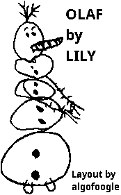

# GDS art generator

Borrowed from <https://tinytapeout.com/guides/creating-silicon-art/>, this is an adaptation of the `make_gds.py` script.

To use this you'll need the Python packages `gdspy` and `pillow` installed (see [`../requirements.txt](../requirements.txt)).

The example artwork included here is [`olaf.png`](./olaf.png):



[`olaf.gds`](./olaf.gds) was generated by running:

```bash
python3 make_gds.py -i olaf.png -c olaf_artwork -o olaf.gds
```

Note that `-c olaf_artwork` names the cell inside the GDS file.

From here, this can be converted in Magic into a `.mag` cell (that you can later place in your layout) by first running `magic` and then issuing these commands in the TCL window:

```tcl
gds read ../gds/olaf.gds
load olaf_artwork
writeall force olaf_artwork
```

Output file will be `olaf_artwork.mag`

Note that in `make_gds.py` you will find `BOUNDARY_LAYERS` and `PIXEL_LAYERS` which you can set to one or more GDS index/datatype pairs, as well as `PIXEL_SIZE` which must be set to something that will result in DRC-valid results.
