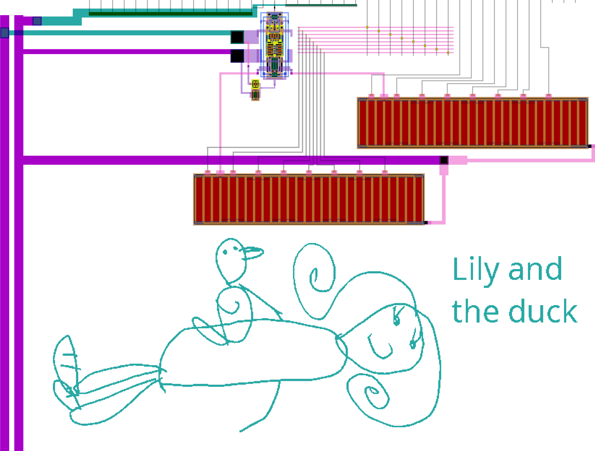
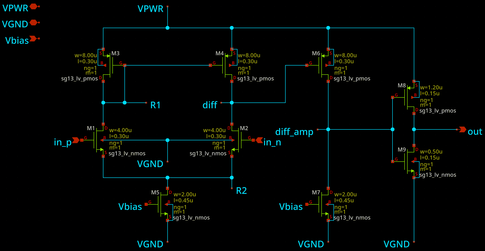
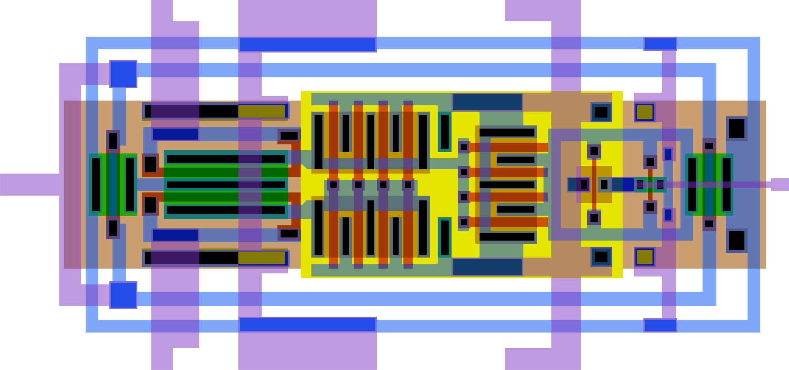
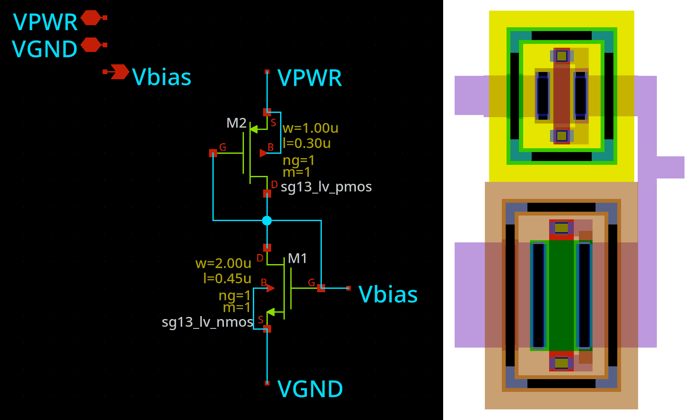
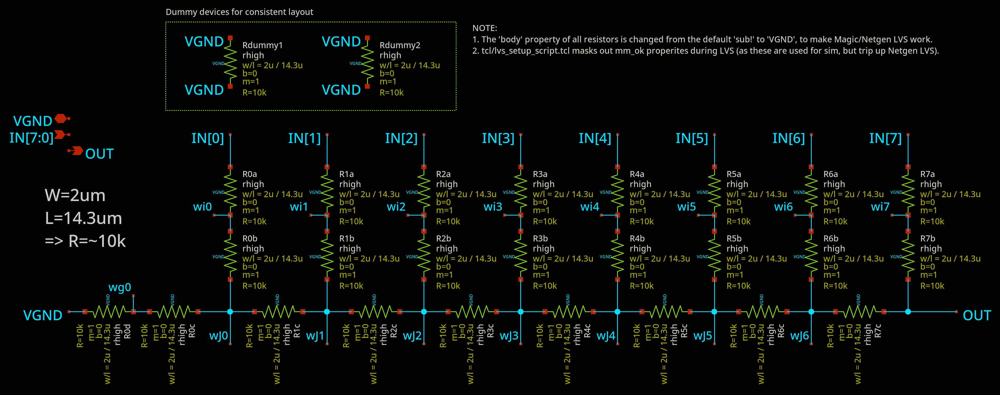
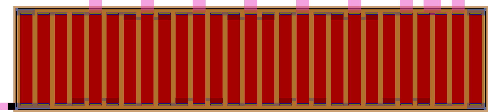

<!---

This file is used to generate your project datasheet. Please fill in the information below and delete any unused
sections.

You can also include images in this folder and reference them in the markdown. Each image must be less than
512 kb in size, and the combined size of all images must be less than 1 MB.
-->

## What is this project?

This custom GDS layout uses Tiny Tapeout 1x1 tile space normally intended for digital-only projects, and implements 4 analog elements that provide a basic testing harness for a simple analog comparator. `ui_in` and `uio_in` (the bidirectional pins) respectively drive DACs to set two voltages to be compared, while `comparator_out` provides the digital comparison result: high if `ui_in` is greater than `uio_in`, or low if `uio_in` is greater.

The output is estimated to be reasonably accurate for DAC codes 64..213 (0.3V to 1.0V).

The GDS art in the bottom half is a drawing done by my daugther when she was 4.

## How does it work?

### Overview

This design can only interface with the outside world using digital IOs (since it is using a Tiny Tapeout 1x1 tile which has no analog ports), and since it is an analog experiment it needs a way to control analog values internally from digital inputs.

I used a simple 8-bit R2R DAC design and created two instances of it: one driven by inputs on `ui_in` (aka `pdac`) and the other on `uio_in` (aka `ndac`). These connect to the positive and negative inputs of the main target of this design: A simple analog comparator. It amplifies the difference between the positive and negative inputs to produce a digital output (`comparator_out`) which is high when the selected positive value is greater than the negative value, and low otherwise.

### Analog blocks

The comparator is a simple design:

With its layout I tried to use a sensible symmetry/matching approach:

The comparator's M5 transistor provides the tail current, and it is matched with M7. The gate reference voltage for these is created by the naively simple Vbias circuit (for which there are probably many better designs I could have used but this is adequate for this very simple design, I think):

The comparator's positive ("in_p") and negative ("in_n") inputs are analog voltages that can be set to anything in the range of 0 to 1.2V (with a step size of ~4.7mV per each of the 256 DAC input codes). The two DACs are a simple R2R design with a target R=10k:

The layout attempts respect matching, including the use of a dummy resistor at each end:

### Performance

Due to having very little time to work on this, I can't say that I'd expect it to perform very well in silicon and across PVT. Nevertheless, parasitic extraction and simulation indicates it should be able to compare voltages reasonably well in the range of 0.3V to 1.0V, to an accuracy of 5mV or better (hopefully able to discriminate DAC inputs that are only 1 code apart).

## How to test

This design doesn't use the `clk` or `rst_n` pins. The bidirectional pins are permanently configured as inputs.

Try comparing values on `ui_in` with those on `uio_in` -- if `ui_in` is greater, `uo_out[7]` should go high. Note that the comparator is generally considered to be reliable for voltages in the range of 0.3V to 1.0V internally -- DAC codes 64..213. Voltages in range of about 0.45V to 0.85V should give the fastest response (on the order of 2~3ns) while codes nearer 0.3V and 1.0V might respond much slower (on the order of 10~20ns).

## External hardware

Not much is needed to test this. The Tiny Tapeout demo board, when configured to drive the bidirectional pins, is quite an easy way to assert the `ui_in` and `uio_in` binary values to the DACs, and `uo_out[7]` (`comparator_out`) can then be observed to see the result.

Besides that, you might want an oscilloscope to measure the output in response to changing inputs.
